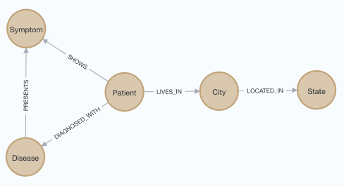
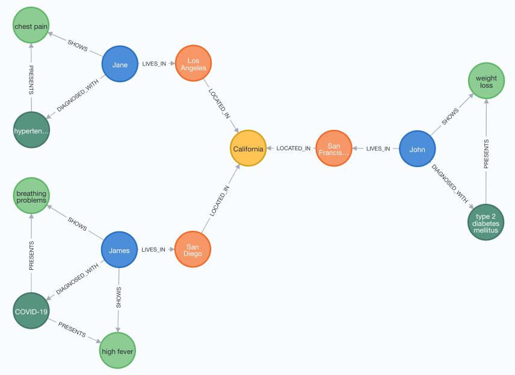

# kg-import

kg-import automates the import of heterogenous data into Knowledge Graphs.

kg-import uses file naming conventions, metadata, and configuration files to create, refactor, and update Knowledge Graphs (KGs).

Changes to the data model can be quickly implemented by simply changing metadata files. This enables fast iterations in the exploratory design of KGs.

The current version supports import of tabular data into the [Neo4j Graph Database](https://neo4j.com/product/neo4j-graph-database/) on Linux and MacOS.

---
## Naming Conventions

### Node and Relationship Naming Conventions
Input files consist of node and relationship files. The conventions and concepts have been adoped from the [Neo4j Graph Database](https://neo4j.com/docs/getting-started/current/graphdb-concepts/#graphdb-naming-conventions) and the [Cypher graph query language](https://opencypher.org/). By following the naming conventions below, node labels and relationship types are defined by their filenames. 

*Metadata files* define the properties, their data types, and descriptions. Metadata are used to create a Metagraph that represents the nodes and relationships.

*Data files* contain the properties of nodes and relationships. 

**Node Labels**: Use the **PascalCase** naming convention, in which the first letter of each word is capitalized.
* City
* Patient
* PatientRecord

**Relationship Types**: Use the **SNAKE_CASE** naming convention, in which words are uppercase and separated by underscore.
* LOCATED_IN
* DIAGNOSED_WITH

**Properties Names**: Use the **cameCase** naming convention, in which the first word is lowercase the first letter of each subsequent word is uppercase.
* startDate

### Metadata File Naming Conventions
**Node metadata filename syntax**: `NodeName.csv`
* City.csv
* Patient.csv

**Relationship metadata filename syntax**: `NodeName1-RELATIONSHIP_NAME-NodeName2.csv`
* City-LOCATED_IN-State.csv
* Patient-DIAGNOSED_WITH-Disease.csv 

### Data File Naming Conventions
**Node data filename syntax**: `NodeName[_tag].csv`, an optional tag can be appended with an underscore if multiple node data files are imported.
* City.csv
* Patient_2020.csv
* Patient_2021.csv

**Relationship data filename syntax**: `NodeName1-RELATIONSHIP_NAME-NodeName2[_tag].csv`, an optional tag can be appended with an underscore if multiple relationship data files are imported.
* City-LOCATED_IN-State.csv
* Patient-DIAGNOSED_WITH-Disease_2020.csv 
* Patient-DIAGNOSED_WITH-Disease_2021.csv

---
## Example Property Graph
This repository contains an example property graph, defined by metadata in the example_metadata dictionary and data file in the example_data dictionary.

### Metadata Files
The example_metadata directory defines a data model that includes the node metadata files:</br>
[Patient](example_metadata/nodes/Patient.csv), [Disease](example_metadata/nodes/Disease.csv), [Symptom](example_metadata/nodes/Symptom.csv), [City](example_metadata/nodes/City.csv), [State](example_metadata/nodes/State.csv), </br>and relationship metadata files:</br> [Disease-PRESENTS-Symptom](example_metadata/relationships/Disease-PRESENTS-Symptom.csv), [Patient-DIAGNOSED_WITH-Disease](example_metadata/relationships/Patient-DIAGNOSED_WITH-Disease.csv), [Patient-LIVES_IN-City](example_metadata/relationships/Patient-LIVES_IN-City.csv), [Patient-SHOWS-Symptom](example_metadata/relationships/Patient-SHOWS-Symptom.csv).

These metadata define the Metagraph:

<p align="center">

</p>


Each metadata file contains four columns:
```
property   : Name of the property
type       : Data type of the property (string, int, ...)
description: Desciption of the property
example    : Example value for a property
```

The following data types are supported:
int, long, float, double, boolean, byte, short, char, string, point, date, localtime, time, localdatetime, datetime. Spatial data (points) require a [specific syntax](https://neo4j.com/docs/cypher-manual/4.4/functions/spatial/). To specify array properties, add "[]" after the data type, e.g., string[]. To support array properties, the input data must be separted by the delimiter `|` (vertical bar)". The example file [State.csv](example_data/nodes/State.csv) demonstrates how to represent points and array properties.

**Metadata file example: Patient.csv**
```
property,type,description,example
id,string,Unique patient id,p02939
firstName,string,First name,John
lastName,string,Last name,Doe
age,int,Age,34
sex,string,Biological sex,male
smoker,boolean,Patient is a smoker,true
```

### Data Files
The example_data directory contains the node data files:</br>
[Patient_2020](example_data/nodes/Patient_2020.csv), [Patient_2021](example_data/nodes/Patient_2021.csv), [Disease](example_data/nodes/Disease.csv), [Symptom](example_data/nodes/Symptom.csv), [City](example_data/nodes/City.csv), [State](example_data/nodes/State.csv), </br>and relationship data files:</br> [Disease-PRESENTS-Symptom](example_data/relationships/Disease-PRESENTS-Symptom.csv), [Patient-DIAGNOSED_WITH-Disease_2020](example_data/relationships/Patient-DIAGNOSED_WITH-Disease_2020.csv), [Patient-DIAGNOSED_WITH-Disease_2021](example_data/relationships/Patient-DIAGNOSED_WITH-Disease_2021.csv), [Patient-LIVES_IN-City](example_data/relationships/Patient-LIVES_IN-City.csv), [Patient-SHOWS-Symptom](example_data/relationships/Patient-SHOWS-Symptom.csv).

These data represent the following property graph:
<p align="center">

</p>

This example demonstrates how to use tags to differentiate multiple files for the same node label, e.g., Patient_2020 and Patient_2021.

**Data file: Patient_2020.csv**
```
id,firstName,lastName,age,sex,smoker
p02939,John,Doe,64,male,true
p38377,Jane,Doe,63,female,false
```
---
## Configuration File

#### Neo4j Graph Database
To configure the import for a Neo4j Graph Database, follow these steps:

1. Clone this Git repository

``` 
git clone https://github.com/sbl-sdsc/kg-import.git
```

2. Create a Conda environment

```
cd kg-import
conda env create -f environment.yml
```

3. Make a copy of the [import_neo4j.sh](import_neo4j.sh) script and configure following variables:

```
NEO4J_HOME=<path_to_neo4j_home>
NEO4J_BIN=<path_to_neo4j_bin>
NEO4J_USERNAME=<neo4j_username>
NEO4J_PASSWORD=<neo4j_password>

# A new database will be created if it does not exist.
# An existing database will be overwritten with the new data.
NEO4J_DATABASE=<neo4j_database_name>

# Absolute paths to node and relationship metadata file directories
NODE_METADATA=<path_to_node_metadata_files>
RELATIONSHIP_METADATA=<path_to_relationship_metadata_files>

# Absolute paths to node and relationship data file directories
NODE_DATA=<path_to_node_csv_files>
RELATIONSHIP_DATA=<path_to_relationship_csv_files>

# Absolute path to the cloned kg-import Git repository
KGIMPORT_GITREPO=<path_to_this_git_repository>
```

---
## Data Import Into Neo4j Knowledge Graph

TODO add detailed instructions here ...

1. Start the Neo4j database instance if it is not running
2. Run the the import_neo4j.sh script: ```./import_neo4j.sh```
3. Start Neoj4 browser and explore the imported Knowledge Graph

---
## Funding
Development of this prototype was in part supported by the National Science Foundation under Award Numbers:

**NSF Convergence Accelerator Phase I (RAISE):** Knowledge Open Network Queries for Research (KONQUER) ([1937136](https://www.nsf.gov/awardsearch/showAward?AWD_ID=1937136))

**NSF RAPID:** COVID-19-Net: Integrating Health, Pathogen and Environmental Data into a Knowledge Graph for Case Tracking, Analysis, and Forecasting ([2028411](https://www.nsf.gov/awardsearch/showAward?AWD_ID=2028411))
