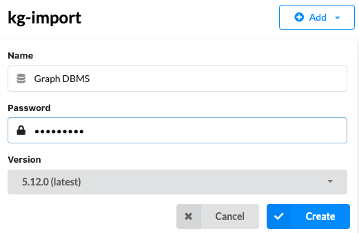
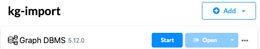
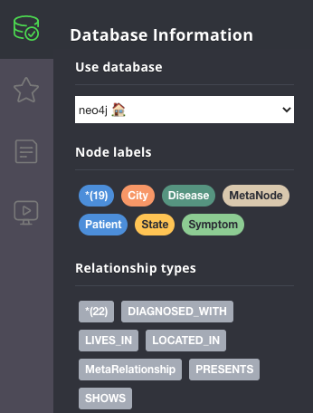

# kg-import

kg-import automates the ingestions of heterogenous datasets into Knowledge Graphs.

kg-import uses file naming conventions, metadata, and configuration files to create, refactor, and update Knowledge Graphs (KGs).

Changes to the data model can be quickly implemented by simply changing metadata files. This enables fast iterations in the exploratory design of KGs.

The current version supports import of tabular data into the [Neo4j Graph Database](https://neo4j.com/product/neo4j-graph-database/) on Linux and MacOS.

---
## Naming Conventions

### Node and Relationship Naming Conventions
Input files consist of node and relationship files. The conventions and concepts have been adoped from the [Neo4j Graph Database](https://neo4j.com/docs/getting-started/current/graphdb-concepts/#graphdb-naming-conventions) and the [Cypher graph query language](https://opencypher.org/). By following the naming conventions below, node labels and relationship types are defined by their filenames. 

*Metadata files* define the properties, their data types, and descriptions. Metadata are used to create a Metagraph that represents the nodes and relationships.

*Data files* contain the properties of nodes and relationships. 

**Node Labels**: Use the **PascalCase** naming convention, in which the first letter of each word is capitalized.
* City
* Patient
* PatientRecord

**Relationship Types**: Use the **SNAKE_CASE** naming convention, in which words are uppercase and separated by underscore.
* LOCATED_IN
* DIAGNOSED_WITH

**Property Names**: Use the **camelCase** naming convention, in which the first word is lowercase the first letter of each subsequent word is uppercase.
* startDate

### Metadata File Naming Conventions
**Node metadata filename syntax**: `NodeName.csv`
* City.csv
* Patient.csv

**Relationship metadata filename syntax**: `NodeName1-RELATIONSHIP_NAME-NodeName2.csv`
* City-LOCATED_IN-State.csv
* Patient-DIAGNOSED_WITH-Disease.csv 

### Data File Naming Conventions
**Node data filename syntax**: `NodeName[_tag].csv`, an optional tag can be appended with an underscore if multiple node data files are imported.
* City.csv
* Patient_2020.csv
* Patient_2021.csv

**Relationship data filename syntax**: `NodeName1-RELATIONSHIP_NAME-NodeName2[_tag].csv`, an optional tag can be appended with an underscore if multiple relationship data files are imported.
* City-LOCATED_IN-State.csv
* Patient-DIAGNOSED_WITH-Disease_2020.csv 
* Patient-DIAGNOSED_WITH-Disease_2021.csv

---
## Data File Requirements
1. Data items containing commas must be quoted.
2. Missing data items must be represented as an empty string.
3. Data records must be represented as a single line in a .csv file, e.g., do not contain line breaks.
4. Duplicate records must be removed.

---
## Example Property Graph
This repository contains an example property graph, defined by metadata files in the example_metadata dictionary and data files in the example_data dictionary.

### Metadata Files
The example_metadata directory defines a data model that includes the node and relationship metadata files:

`├──  example_metadata`</br>
`│ ` `  ├──  nodes`</br>
`│ ` `  │ ` ` ├── `[City.csv](example_metadata/nodes/City.csv)</br>
`│ ` `  │ ` ` ├── `[Disease.csv](example_metadata/nodes/Disease.csv)</br>
`│ ` `  │ ` ` ├── `[Patient.csv](example_metadata/nodes/Patient.csv)</br>
`│ ` `  │ ` ` ├── `[State.csv](example_metadata/nodes/State.csv)</br>
`│ ` `  │ ` ` └── `[Symptom.csv](example_metadata/nodes/Symptom.csv)</br>
`│ ` `  └──  relationships`</br>
`│ ` `  ` `  ` ` ├── `[City-LOCATED_IN-State.csv](example_metadata/relationships/City-LOCATED_IN-State.csv)</br>
`│ ` `  ` `  ` ` ├── `[Disease-PRESENTS-Symptom.csv](example_metadata/relationships/Disease-PRESENTS-Symptom.csv)</br>
`│ ` `  ` `  ` ` ├── `[Patient-DIAGNOSED_WITH-Disease.csv](example_metadata/relationships/Patient-DIAGNOSED_WITH-Disease.csv)</br>
`│ ` `  ` `  ` ` ├── `[Patient-LIVES_IN-City.csv](example_metadata/relationships/Patient-LIVES_IN-City.csv)</br>
`│ ` `  ` `  ` ` └── `[Patient-SHOWS-Symptom.csv](example_metadata/relationships/Patient-SHOWS-Symptom.csv)</br>


These metadata define the schema or metagraph:


Each metadata file contains four columns:
```
property   : Name of the property
type       : Data type of the property (string, int, ...)
description: Desciption of the property
example    : Example value for a property
```

The following data types are supported:
int, long, float, double, boolean, byte, short, char, string, point, date, localtime, time, localdatetime, datetime. Spatial data (points) require a [specific syntax](https://neo4j.com/docs/cypher-manual/4.4/functions/spatial/). To specify array properties, add "[]" after the data type, e.g., string[]. To support array properties, the input data must be separated by the delimiter `|` (vertical bar)". The example file [State.csv](example_data/nodes/State.csv) demonstrates how to represent points and array properties.

**Metadata file example: Patient.csv**
```
property,type,description,example
id,string,Unique patient id,p02939
firstName,string,First name,John
lastName,string,Last name,Doe
age,int,Age,34
sex,string,Biological sex,male
smoker,boolean,Patient is a smoker,true
```

### Data Files
The example_data directory mirrors the organization of the metadata. It contains the node and relationship data files that match the node and relationship names from the metadata.

`├── example_data`</br>
`│ ` `  ├── nodes`</br>
`│ ` `  │ ` ` ├── `[City.csv](example_data/nodes/City.csv)</br>
`│ ` `  │ ` ` ├── `[Disease.csv](example_data/nodes/Disease.csv)</br>
`│ ` `  │ ` ` ├── `[Patient_2020.csv](example_data/nodes/Patient_2020.csv)</br>
`│ ` `  │ ` ` ├── `[Patient_2021.csv](example_data/nodes/Patient_2021.csv)</br>
`│ ` `  │ ` ` ├── `[State.csv](example_data/nodes/State.csv)</br>
`│ ` `  │ ` ` └── `[Symptom.csv](example_data/nodes/Symptom.csv)</br>
`│ ` `  └── relationships`</br>
`│ ` `  ` `  ` ` ├── `[City-LOCATED_IN-State.csv](example_data/relationships/City-LOCATED_IN-State.csv)</br>
`│ ` `  ` `  ` ` ├── `[Disease-PRESENTS-Symptom.csv](example_data/relationships/Disease-PRESENTS-Symptom.csv)</br>
`│ ` `  ` `  ` ` ├── `[Patient-DIAGNOSED_WITH-Disease_2020.csv](example_data/relationships/Patient-DIAGNOSED_WITH-Disease_2020.csv)</br>
`│ ` `  ` `  ` ` ├── `[Patient-DIAGNOSED_WITH-Disease_2021.csv](example_data/relationships/Patient-DIAGNOSED_WITH-Disease_2021.csv)</br>
`│ ` `  ` `  ` ` ├── `[Patient-LIVES_IN-City.csv](example_data/relationships/Patient-LIVES_IN-City.csv)</br>
`│ ` `  ` `  ` ` └── `[Patient-SHOWS-Symptom.csv](example_data/relationships/Patient-SHOWS-Symptom.csv)</br>


These data represent the following property graph:


This example demonstrates how to use tags to differentiate multiple files for the same node label, e.g., Patient_2020 and Patient_2021.

**Data file: Patient_2020.csv**
```
id,firstName,lastName,age,sex,smoker
p02939,John,Doe,64,male,true
p38377,Jane,Doe,63,female,false
```

**Data file: Patient_2021.csv**
```
id,firstName,lastName,age,sex,smoker
p93948,James,Bond,52,male,true
```

---
## Run Neo4j Data Import on Google Colab
[ExampleQueries_colab](notebooks/ExampleQueries_colab.ipynb) <a target="_blank" href="https://colab.research.google.com/github/sbl-sdsc/kg-import/blob/main/notebooks/ExampleQueries_colab.ipynb">  </a>

---
## Data Import Into Neo4j Desktop

### Installing Neo4j Desktop on MacOS


2. Download the Neo4j Desktop application from the [Neo4j Download Center](https://neo4j.com/download-center/#desktop) and follow the installation instructions.

3. When the installation is complete, Neo4j Desktop will launch. Click the `New` button to create a new project.


4. Hover the cursor next to `Project` in the newly created project, then click the edit button and change the project name to `kg-import`

5. Click the `ADD` button and select `Local DBMS`. Select the latest version. Then enter the password `neo4jdemo` and click `Create`.
    

    
6. Select `Terminal` to open a terminal window.
    


7. Type `pwd` in the terminal window to show the path to the `NEO4J_HOME` directory. This path is required to configure the import_neo4j.sh script, see next section.
```
bash-3.2$ pwd
/Users/User/Library/Application Support/Neo4j Desktop/Application/relate-data/dbmss/dbms-763cbf0d-6660-412a-8042-c55ae40d5290
```


### Software Setup

------
Prerequisites: Miniconda3 (light-weight, preferred) or Anaconda3 and Mamba (faster than Conda)

* Install [Miniconda3](https://docs.conda.io/en/latest/miniconda.html)
* Update an existing miniconda3 installation: ```conda update conda```
* Install Mamba: ```conda install mamba -n base -c conda-forge```
* Install Git (if not installed): ```conda install git -n base -c anaconda```
------

1. Clone the kg-import Repository

```
git clone https://github.com/sbl-sdsc/kg-import.git
```

2. Create a Conda environment

The file `environment.yml` specifies the Python version and all required dependencies.

```
mamba env create -f environment.yml
```


### Importing the Example Data into Neo4j Desktop

1. Copy the file .env_desktop_template to .env_desktop

2. Edit the file .env_desktop and set the following environment variables:
```
 # Absolute path to Neo4j home directory in double quotes
 NEO4J_HOME="/Users/User/Library/Application Support/Neo4j Desktop/Application/relate-data/dbmss/dbms-763cbf0d-6660-412a-8042-c55ae40d5290"
 #
 # Absolute path to Neo4j bin directory (on MacOS: NEO4J_BIN=${NEO4J_HOME}/bin)
 NEO4J_BIN=${NEO4J_HOME}/bin
 #
 # Username, password, and the name of the database
 NEO4J_USERNAME=neo4j
 NEO4J_PASSWORD=neo4jdemo
 NEO4J_DATABASE=kg-import
 #
 # Absolute paths to node and relationship metadata file directories
 NEO4J_METADATA=/Users/User/GitRepositories/kg-import/example_metadata
 #
 # Absolute paths to node and relationship data file directories
 NEO4J_DATA=/Users/User/GitRepositories/kg-import/example_data
```
  
3. Start Neo4j Graph DBMS in the Neo4j Desktop.



4. Activate the conda environment

```
conda activate kg-import
```

5. Run the ImportToDesktop Jupyter Notebook in the notebooks directory.

6. Click `Open` to launch Neo4j Browser.


7. Neo4j Browser will launch. Click on the database icon on the top left. Wait (~20-30 seconds) until the Node Labels and Relationship Types are displayed.




8. Now you are ready to explore the example database!

Double-click on Node Label `*(19)` to display all nodes in the example graph. Click on Patient `Jane` to show the properties of the node.


---
## Citation
Peter W. Rose, kg-import: A tool for ingesting heterogenous datasets into Knowledge Graphs. Available online: https://github.com/sbl-sdsc/kg-import (2021).

---
## Funding
Development of this prototype was in part supported by the National Science Foundation under Award Numbers:

**NSF Convergence Accelerator Phase I (RAISE):** Knowledge Open Network Queries for Research (KONQUER) ([1937136](https://www.nsf.gov/awardsearch/showAward?AWD_ID=1937136))

**NSF RAPID:** COVID-19-Net: Integrating Health, Pathogen and Environmental Data into a Knowledge Graph for Case Tracking, Analysis, and Forecasting ([2028411](https://www.nsf.gov/awardsearch/showAward?AWD_ID=2028411))
